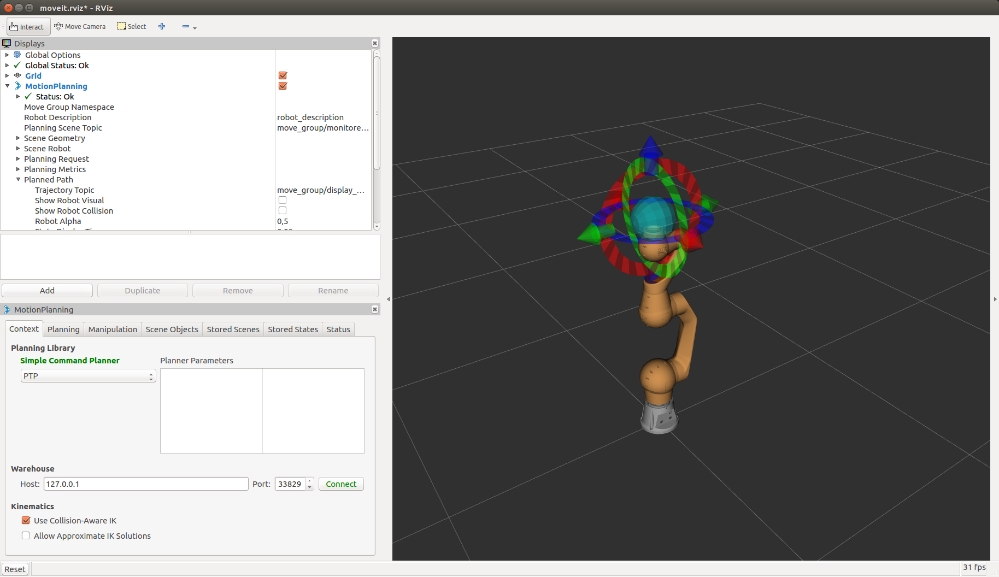

<!--
Software License Agreement (BSD License)

Copyright (c) 2018 Pilz GmbH & Co. KG
All rights reserved.

Redistribution and use in source and binary forms, with or without
modification, are permitted provided that the following conditions
are met:

 * Redistributions of source code must retain the above copyright
   notice, this list of conditions and the following disclaimer.
 * Redistributions in binary form must reproduce the above
   copyright notice, this list of conditions and the following
   disclaimer in the documentation and/or other materials provided
   with the distribution.
 * Neither the name of Pilz GmbH & Co. KG nor the names of its
   contributors may be used to endorse or promote products derived
   from this software without specific prior written permission.

THIS SOFTWARE IS PROVIDED BY THE COPYRIGHT HOLDERS AND CONTRIBUTORS
"AS IS" AND ANY EXPRESS OR IMPLIED WARRANTIES, INCLUDING, BUT NOT
LIMITED TO, THE IMPLIED WARRANTIES OF MERCHANTABILITY AND FITNESS
FOR A PARTICULAR PURPOSE ARE DISCLAIMED. IN NO EVENT SHALL THE
COPYRIGHT OWNER OR CONTRIBUTORS BE LIABLE FOR ANY DIRECT, INDIRECT,
INCIDENTAL, SPECIAL, EXEMPLARY, OR CONSEQUENTIAL DAMAGES (INCLUDING,
BUT NOT LIMITED TO, PROCUREMENT OF SUBSTITUTE GOODS OR SERVICES;
LOSS OF USE, DATA, OR PROFITS; OR BUSINESS INTERRUPTION) HOWEVER
CAUSED AND ON ANY THEORY OF LIABILITY, WHETHER IN CONTRACT, STRICT
LIABILITY, OR TORT (INCLUDING NEGLIGENCE OR OTHERWISE) ARISING IN
ANY WAY OUT OF THE USE OF THIS SOFTWARE, EVEN IF ADVISED OF THE
POSSIBILITY OF SUCH DAMAGE.
-->

# Acceptance Test LIN Motion using the MoveIt Motion Planning Plugin on the real robot
This test checks that the real robot system is able to perform a LIN Motion to a goal state given by the user. The test is performed using the moveit motion planning plugin. Note that before you can apply the LIN command the robot has
to be moved out of singularities.

## Prerequisites
  - Properly connect and startup the robot. Make sure a emergency stop is within reach.

## Test Sequence:
  1. Bringup can: `sudo ip link set can0 up type can bitrate 1000000`
  2. Run `roslaunch prbt_moveit_config moveit_planning_execution.launch sim:=False pipeline:=pilz_industrial_motion_planner`
  3. In the motion planing widget (lower left part of moveit) choose PTP in the dropdown below "Trapezoidal Command Planner" (see image)

  4. Switch to the tab "Planning" in the moveit planning plugin. Move the ball handle to select a singularity free position. Click on "plan and execute".

  5. The motion planning widget (lower left part of moveit) choose LIN in the dropdown below "Trapezoidal Command Planner" (see image)

  6. Switch to the tab "Planning" in the moveit planning plugin. Move the ball handle the select goal pose.
     Move the robot about 10-20cm choose a goal where the configuration has no jumps. Set velocity and acceleration scaling to 0.1. Click on "plan and execute".

## Expected Results:
  1. Can should be visible with `ifconfig` displayed as can0
  2. A -click- indicates the enabling of the drives.
  3. PTP was available for selection
  4. The robot should move to the desired position.
  5. LIN was available for selection
  6. The robot should move to the desired position via a straight line.
---
