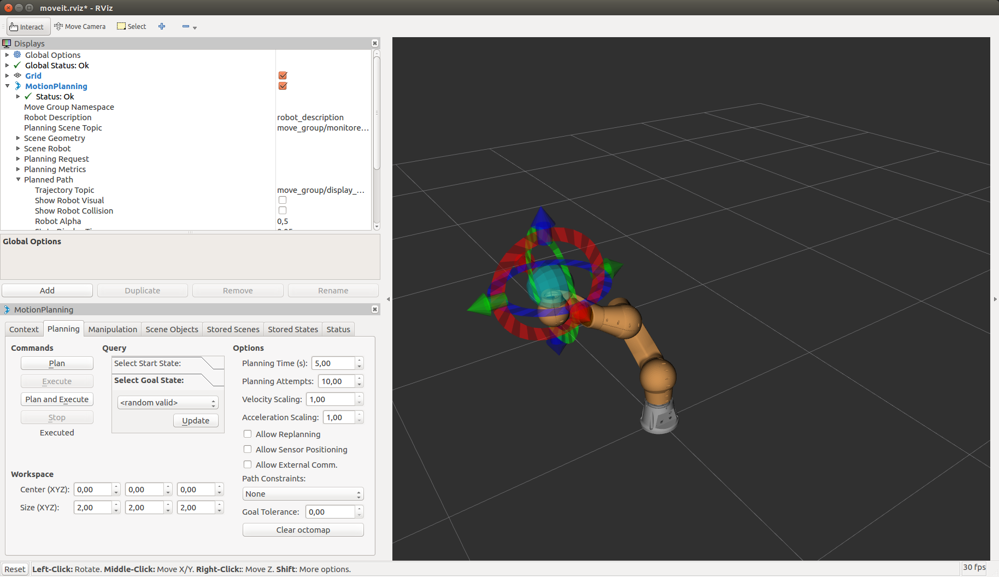
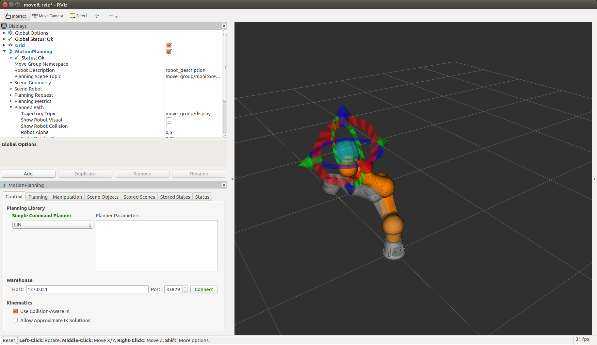
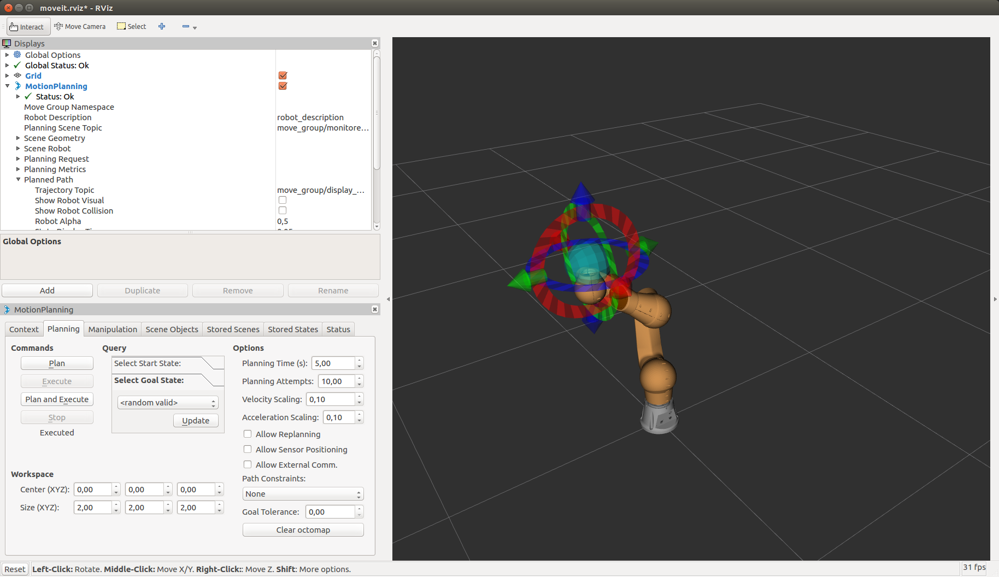

<!--
Copyright © 2018 Pilz GmbH & Co. KG

Licensed under the Apache License, Version 2.0 (the "License");
you may not use this file except in compliance with the License.
You may obtain a copy of the License at

    http://www.apache.org/licenses/LICENSE-2.0

Unless required by applicable law or agreed to in writing, software
distributed under the License is distributed on an "AS IS" BASIS,
WITHOUT WARRANTIES OR CONDITIONS OF ANY KIND, either express or implied.
See the License for the specific language governing permissions and
limitations under the License.

/*
Copyright (c) 2018 Pilz GmbH & Co. KG

This program is free software: you can redistribute it and/or modify
it under the terms of the GNU Lesser General Public License as published by
the Free Software Foundation, either version 3 of the License, or
(at your option) any later version.

This program is distributed in the hope that it will be useful,
but WITHOUT ANY WARRANTY; without even the implied warranty of
MERCHANTABILITY or FITNESS FOR A PARTICULAR PURPOSE.  See the
GNU Lesser General Public License for more details.

You should have received a copy of the GNU Lesser General Public License
along with this program.  If not, see <http://www.gnu.org/licenses/>.
 */

-->

# Acceptance Test LIN Motion using the MoveIt Motion Planning Plugin on the real robot
This test checks that the real robot system is able to perform a LIN Motion to a goal state given by the user. The test is performed using the moveit motion planning plugin. Note that before you can apply the LIN command the robot has
to be moved out of singularities.

## Prerequisites
  - Properly connect and startup the robot. Make sure a emergency stop is within reach.

## Test Sequence:
  1. Bringup can: `sudo ip link set can0 up type can bitrate 1000000`
  2. Run `roslaunch prbt_moveit_config moveit_planning_execution.launch sim:=False pipeline:=trapezoidal_command_planner`
  3. In the motion planing widget (lower left part of moveit) choose PTP in the dropdown below "Simple Command Planner" (see image)

  4. Switch to the tab "Planning" in the moveit planning plugin. Move the ball handle to select a singularity free position. Click on "plan and execute".

  5. The motion planning widget (lower left part of moveit) choose LIN in the dropdown below "Simple Command Planner" (see image)

  6. Switch to the tab "Planning" in the moveit planning plugin. Move the ball handle the select goal pose.
     Move the robot about 10-20cm choose a goal where the configuration has no jumps. Set velocity and acceleration scaling to 0.1. Click on "plan and execute".

## Expected Results:
  1. Can should be visible with `ifconfig` displayed as can0
  2. A -click- indicates the enabling of the drives.
  3. PTP was available for selection
  4. The robot should move to the desired position.
  5. LIN was available for selection
  6. The robot should move to the desired position via a straight line.
---
